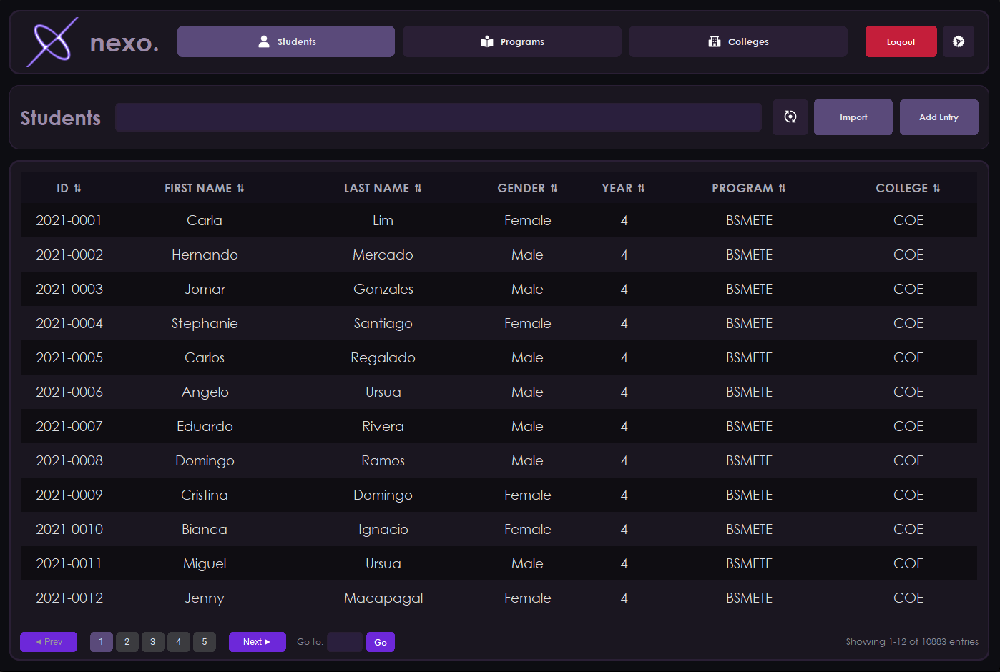

<p align="center">
  
</p>

<h1 align="center">nexo</h1>

<p align="center">
  <b>Version 2.0.1</b><br/>
  Desktop Student Information System built with Python, CustomTkinter, and SQLite
</p>

<p align="center">
  
  
  
  
  
</p>

<p align="center">
  
</p>

---

## Overview

nexo is a desktop SIS with CRUDL workflows for Students, Programs, and Colleges.

Highlights in 2.0.1:

- Simplified admin entry flow with Proceed as Administrator
- Theme system with Light or Dark mode plus 4 color presets (Purple, Blue, Orange, Pink)
- Theme-aware branding assets and refreshed dashboard/login visuals
- Search, sort, bulk actions, and pagination in list views
- Sidebar analytics including college distribution and year-level rankings
- SQLite persistence via SQLAlchemy
- PyInstaller one-file Windows build pipeline

---

## Tech Stack

| Component | Technology |
|---|---|
| Language | Python 3.13+ |
| UI Framework | CustomTkinter |
| Database | SQLite + SQLAlchemy |
| Charts | Matplotlib + NumPy (with Tk canvas fallback in packaged mode) |
| Packaging | PyInstaller |

---

## Setup (Development)

### Prerequisites

- Python 3.13+

### Install

```bash
python -m venv .venv
.venv\Scripts\activate
pip install -r requirements.txt
```

### Run

```bash
python main.py
```

The app uses `nexo.db` in the project root for local development.

---

## Build Executable (Windows)

```bat
build_exe.bat
```

What `build_exe.bat` does:

- Uses Python 3.13 build interpreter
- Installs/updates dependencies from `requirements.txt`
- Builds `dist\nexo.exe` with PyInstaller
- Bundles runtime assets, UI modules, backend modules, and SQLAlchemy dependencies
- Bundles current `nexo.db`

### Data Seeding Behavior in EXE

On first run in a new folder:

- If `nexo.db` does not exist beside `nexo.exe`, the app copies bundled `nexo.db` into place
- This preserves the seeded dataset shipped at build time (including large student sets)

---

## Project Structure

```text
nexo-database/
|- main.py
|- config.py
|- requirements.txt
|- build_exe.bat
|- nexo.spec
|- nexo.db

|- assets/
|  |- icons/
|  |- screenshots/
|- backend/
|  |- __init__.py
|  |- auth.py
|  |- database.py
|  |- models.py
|  |- storage.py
|  |- validators.py
|  |- search/
|  |- sort/
|- frontend_ui/
|  |- auth/
|  |- dashboard/
|  |- ui/
|  |- views/
```

---

## Notes

- This project currently uses an admin entry action instead of persisted login credentials.
- Theme preferences are stored in `theme_prefs.json`.
